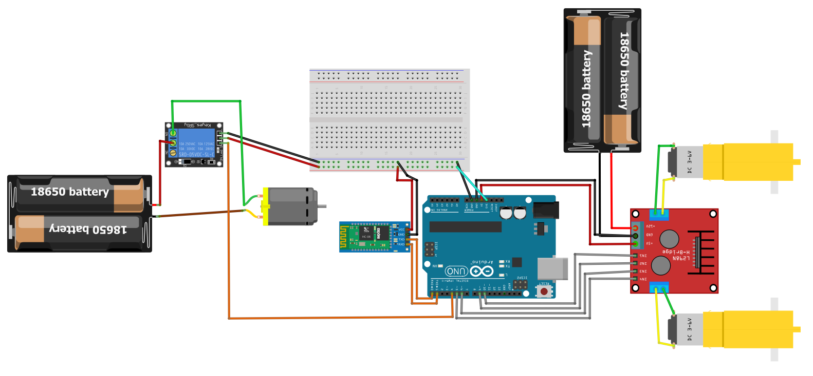

# RobotSlayer
Battlebot llamado RobotSlayer (ex-rotorcrart). Construido por estudiantes de la Facultad de Ingenieria de la Universidad de Chile. La primera versión se creo para el curso Taller de Proyecto en Otoño 2019, luego se le han realizado mejoras. 

# Modelo CAD

## Circuito Electro-mecanico

### Materiales
  * Arduino Uno
  * 2 motores dc con ...
  * Puente H L298n
  * 2 ruedas con tracción
  * 1 rueda pivote
  * Cables de distintos tamaños y grosores
  * 4 pilas 18650 
  * 2 porta pilas
  * Bluetooth HC06
  * un interruptor con gran capacidad
  * Relé con gran capacidad

## Aplicación Android

Se creo una aplicación simple para controlar el robot, se utilizó la página del MIT App Inventor la cual permite realizar de forma simple una aplicación.

### Bot Controls
 * `up`- move bot forwards 
 * `down` - move bot backwards 
 * `on` - activate weapon
 * `off` - deactivate weapon 
 * `right` - turn right
 * `left` - spin flag

## Creditos:  
Aejandro Chepillo - Raimundo Andrade - Joaquin Zepeda
